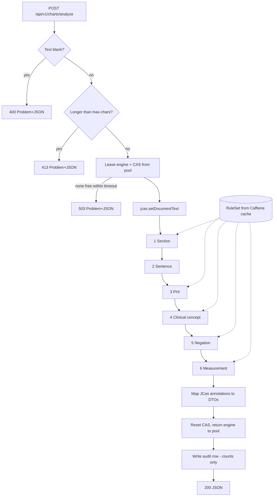
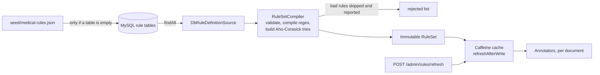

# Architecture

This is the design the implementation follows. It started as the proposal and has been updated to match what was built.

## 1. Goal

A Spring Boot REST service that takes a free-text medical chart and runs it through **one Apache UIMA pipeline**
built from a few small annotators. It returns structured findings: sections, sentences, medical concepts with
vocabulary codes, negation status, vitals/labs/dosages, and PHI spans.

All rules — regexes, trigger terms, codes, negation triggers — live in **MySQL**, so behaviour changes by editing rows
and calling a refresh endpoint, with no redeploy.

## 2. Component view

```
                         ┌─────────────────────────────────────────────────┐
  Client (curl/Swagger)  │             Spring Boot 3 (Java 21)             │
  ───────────────────►   │                                                 │
   POST /api/v1/charts/  │  ChartController ──► ChartAnalysisService       │
        analyze          │   (validation,          │  validate · map JCas  │
                         │    RFC 7807 errors)     │  to DTO · audit       │
                         │                 ┌───────▼────────┐              │
                         │                 │   EnginePool   │ N engines,   │
                         │                 │ (engine + JCas)│ 1 CAS each   │
                         │                 └───────┬────────┘              │
                         │   ┌─────────────────────▼───────────────────┐   │
                         │   │  Aggregate Analysis Engine (fixed flow) │   │
                         │   │  1 SectionAnnotator        regex        │   │
                         │   │  2 SentenceAnnotator       rules        │   │
                         │   │  3 PhiAnnotator            regex        │   │
                         │   │  4 ClinicalConceptAnnotator Aho-Corasick│   │
                         │   │  5 NegationAnnotator       NegEx-style  │   │
                         │   │  6 MeasurementAnnotator    regex        │   │
                         │   └─────────────────────┬───────────────────┘   │
                         │                         │ reads current RuleSet │
                         │  RuleProviderRegistry ◄─┘ (per document)        │
                         │        │                                        │
                         │  RuleService ── Caffeine cache (compiled        │
                         │        │        RuleSet, refresh-after-write)   │
                         │        │                                        │
                         │  RuleSetCompiler (validate · compile · reject)  │
                         └────────┼────────────────────────────────────────┘
                                  ▼
                       MySQL 8.4 (schema by Flyway)
        section_header · regex_rule · concept · trigger_term
        negation_trigger · processing_run (audit: counts only, no text)
```

### 2a. Web UI

```
 Browser  ──────────────  Angular 21 single-page app (frontend/, built into the jar → /static)
   │                        ┌────────────────────────────────────────────────────────┐
   │  http://localhost:8080 │ App shell: backend status · Rules panel                │
   │                        │ ChartEditor ─┐        ┌─ Results (tabs)                 │
   │                        │  edit/load/  │        │  Highlighted · Concepts · …     │
   │                        │  save        ▼        ▲                                 │
   │                        │            AnalysisStore  (signals: text, response,    │
   │                        │              │   analyzedText, stale, error, rules)    │
   │                        │   SavedChartsService      ChartApi (HttpClient)         │
   │                        │   (localStorage only)         │                         │
   │                        └───────────────────────────────┼─────────────────────────┘
   └──── same origin ─────────────────────────────────────►  /api/v1/*  (Spring Boot)
```

- **One origin.** Maven (`-Pui`) builds the Angular app and copies it into `target/classes/static`, so Spring Boot serves the UI and the API from port 8080: no CORS, one process, one jar. In development (`run.bat dev`) the Angular dev server proxies `/api` to the backend.
- **State in one store.** `AnalysisStore` owns the chart text, the latest response, and the *exact text that response belongs to* (`analyzedText`). Highlights are always drawn from `analyzedText`, never from the live editor text, so offsets can never drift while you type; `stale` tells you the two differ.
- **Requests cannot arrive out of order.** Starting a new analysis unsubscribes the old request (the browser cancels it), so a slow earlier response can never overwrite a newer one.
- **Highlighting is a pure function** (`highlight.ts`): it cuts the text at every annotation boundary and lists which annotations cover each piece, so overlapping findings (a concept inside a measurement) are painted together. The server's offsets are UTF-16 indexes, the same as JavaScript string indexes, so emoji and accents line up.
- **Saved charts never touch the server.** They live in `localStorage`; every storage access is guarded (blocked, full, corrupt, or an insecure origin without `crypto.randomUUID`).
- **Bounded rendering.** The annotated view is capped at 150,000 characters (thousands of DOM nodes would freeze the page); the tables have no such limit.

## 3. Request flow



Rule loading and refresh:



## 4. The pipeline

| # | Annotator | Reads | Produces | Technique |
|---|-----------|-------|----------|-----------|
| 1 | `SectionAnnotator` | `section_header` | `ChartSection` (name, experiencer) | Regex on header lines; a section runs to the next header |
| 2 | `SentenceAnnotator` | (built-in) | `ChartSentence` | Rule-based: newline, `;`, `.!?` with abbreviation / decimal / initial guards |
| 3 | `PhiAnnotator` | `regex_rule` (group PHI) | `PhiSpan` | Regex; overlaps resolved to the longest |
| 4 | `ClinicalConceptAnnotator` | `concept`, `trigger_term` | `ClinicalConcept` (code, system, category, section) | Aho-Corasick, longest match, word boundaries, whitespace-tolerant |
| 5 | `NegationAnnotator` | `negation_trigger` | sets `negated` / `negationTrigger` | NegEx-style: PRE / POST / PSEUDO / TERMINATION triggers, sentence scope, token window |
| 6 | `MeasurementAnnotator` | `regex_rule` (group MEASUREMENT) | `Measurement` (type, value, unit) | Regex with a chosen capture group as value |

Order matters: negation needs sentences and concepts, and concepts use the sections.

## 5. UIMA type system (JCas)

`src/main/resources/desc/MedicalTypeSystem.xml` is the single source of truth. `jcasgen-maven-plugin` generates the
JCas cover classes into `com.example.mednlp.types` at build time (`ChartSection`, `ChartSentence`,
`ClinicalConcept`, `PhiSpan`, `Measurement`), so annotators use typed getters/setters and no string feature names.

## 6. Data model (MySQL)

| Table | Purpose | Key columns |
|-------|---------|-------------|
| `section_header` | Section header regexes | `name`, `pattern`, `priority`, `experiencer`, `enabled` |
| `regex_rule` | PHI and measurement regexes | `rule_name`, `rule_group` (PHI/MEASUREMENT), `category`, `pattern`, `value_group`, `unit`, `enabled` |
| `concept` | Vocabulary concepts | `code`, `code_system` (ICD10CM/RXNORM/LOINC), `preferred_name`, `category`, `enabled` |
| `trigger_term` | Terms that evoke a concept | `term` (unique), `case_sensitive`, `concept_id`, `enabled` |
| `negation_trigger` | NegEx triggers | `term` (unique), `trigger_type` (PRE/POST/PSEUDO/TERMINATION), `enabled` |
| `processing_run` | Audit | timestamps, counts, duration — **never chart text** |

The schema is created by Flyway (`V1__schema.sql`, portable across MySQL and H2). Empty rule tables are filled once
from `seed/medical-rules.json`; tables that already have rows are never touched, so operator edits survive restarts.

## 7. Key design decisions

| Decision | Why |
|----------|-----|
| **Engine pool**, not a shared engine | A UIMA engine and CAS are not thread-safe. The pool bounds memory, and a full pool answers 503 instead of queueing without limit. |
| **Caffeine** for the rule cache | Compiling regexes and building tries per request would dominate latency. In-process, free, no extra service. `refreshAfterWrite` keeps serving the last good rules if MySQL is unreachable. Redis is only needed to share a cache across instances, which this demo does not require. |
| **Aho-Corasick** for terms | One pass over the text regardless of vocabulary size; the vocabulary can grow to thousands of terms without slowing requests. |
| **Rules read per document, not per engine** | A refresh affects the very next chart without rebuilding any engine. |
| **`RuleProviderRegistry` (id lookup)** | UIMA creates annotators itself, so Spring beans cannot be injected. Each annotator gets a plain-string provider id and looks it up. Each `RuleService` has a unique id, so several application contexts never mix rules. |
| **Bad rules are skipped, not fatal** | Rows are hand-edited. Invalid or dangerous regexes are rejected at compile time and listed by `/api/v1/rules/summary`. |
| **Two layers of regex protection** | A static check rejects nested unbounded quantifiers such as `(a+)+`; a runtime deadline (`mednlp.regex-timeout-ms`) stops anything else. A timed-out rule is skipped for that document only. |
| **Seed from JSON, not SQL** | MySQL treats `\` in string literals as an escape and H2 does not; loading from JSON avoids that trap and keeps one source for tests and runtime. |
| **Offsets always refer to the original text** | Matching runs on a whitespace-normalised copy with an offset map, so irregular spacing still matches but reported spans are exact. |
| **PHI-safe by construction** | Chart text is never stored or logged, error responses do not echo it, and the audit table holds counts only. |

## 8. Tech stack

| Concern | Choice |
|---------|--------|
| Language / build | Java 21, Maven (wrapper included), Spring Boot 3.5 |
| NLP | Apache UIMA 3.6 (`uimaj-core`, JCas) + uimaFIT for programmatic pipeline assembly |
| Rule store | MySQL 8.4, Flyway, Spring Data JPA (Hibernate) |
| Cache | Caffeine |
| Term matching | Aho-Corasick (`org.ahocorasick:ahocorasick`) |
| API docs / ops | springdoc-openapi (Swagger UI), Spring Boot Actuator |
| Web UI | Angular 21 (standalone components, signals, zoneless), built into the jar by `frontend-maven-plugin` with a Maven-managed Node |
| Tests | JUnit 5, AssertJ, MockMvc; H2 in MySQL mode. UI: Vitest + jsdom |
| Local infra | Docker Compose (MySQL) or an in-memory H2 profile |

Everything above is open source / free.

### UI-specific decisions

| Decision | Why |
|----------|-----|
| **UI inside the Spring Boot jar** (opt-in `-Pui`) | One artifact, one origin (no CORS), one command. Kept opt-in so `mvn test` stays fast and offline; `run.bat` turns it on. |
| **Maven-managed Node** | Running the app needs no Node installation. System Node is only needed for UI development. |
| **Angular 21, not 22** | Angular 22 needs Node 22.22+; 21 runs on Node 20.19+, which more machines have. |
| **Samples come from `samples/`** | One copy of each chart feeds the backend tests, the docs and the UI picker (`scripts/copy-samples.mjs`, because Angular cannot bundle files outside its workspace). |
| **UI reads and reloads rules but does not edit them** | Rule editing needs authenticated write endpoints, validation UX and audit, which is a different feature; SQL plus the refresh button covers the demo. |
| **Always request PHI redaction and sentences** | They are cheap and give the Redacted / Sentences tabs without options to explain. |

## 9. Known limitations

These are deliberate for a demo and are pinned down by tests where behaviour is observable.

1. **Negation is lexical (NegEx-style), not syntactic.** "No fever, has cough" can wrongly negate "cough" if it falls inside the token window and no terminator is present. "not taking metformin" is reported as negated.
2. **Family history is section-level only.** "Mother had diabetes" inside an HPI paragraph is still attributed to the patient.
3. **Allergies are not distinguished.** A drug named in an `ALLERGIES` section is extracted as a medication concept; use the `section` field to interpret it.
4. **No temporal or hypothetical context** ("history of", "possible", "rule out" are not modelled).
5. **Sentences are line-based.** A prose sentence hard-wrapped over several lines is split at each line break; a period followed by a lower-case word does not end a sentence.
6. **The vocabulary is illustrative.** About 40 hand-picked codes; verify against official ICD-10-CM / RxNorm / LOINC releases before real use. SNOMED CT is excluded (licensed).
7. **PHI detection is heuristic, not HIPAA de-identification.** Names are caught only after a `Patient:` label; there is no NER.
8. **One concept per term.** `trigger_term.term` is unique, so an ambiguous term maps to a single concept. MySQL's default collation also makes that uniqueness case-insensitive (so `MI` and `mi` cannot both be stored).
9. **Admin endpoints are unauthenticated.** Put the service behind Spring Security or a gateway before exposing it.
10. **The rule cache is per instance.** With several instances, call refresh on each (or add a shared cache / message-based invalidation).
